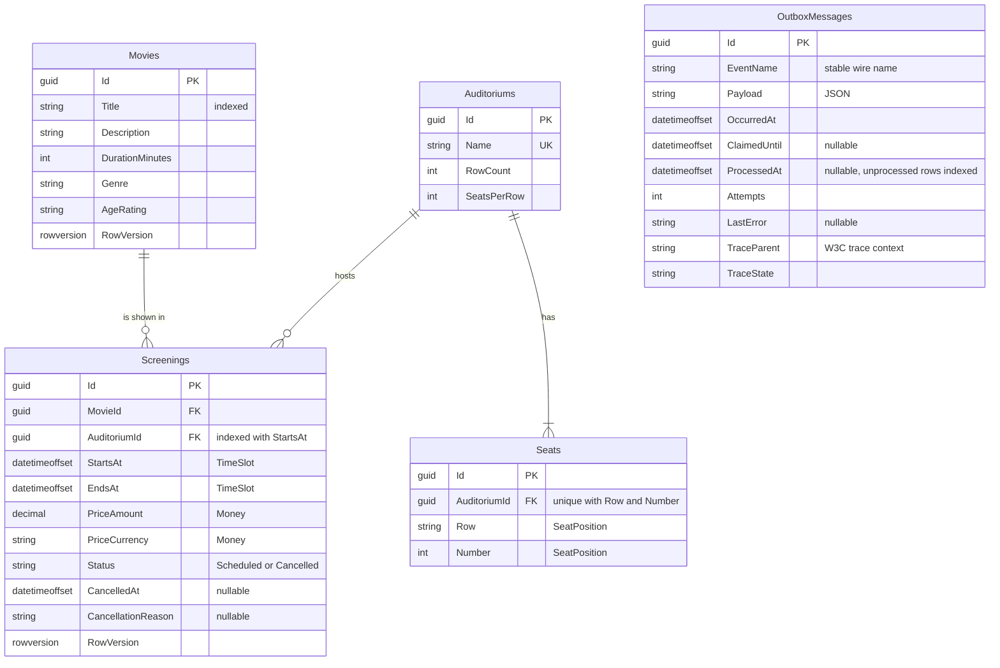
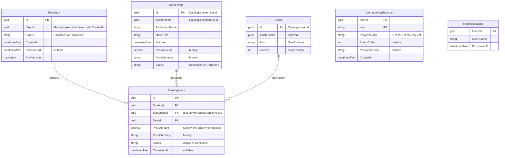

# QubicaCinema

[](https://github.com/UshRosi/qubicaCinema/actions/workflows/ci.yml)

A cinema seat-booking backend: browse screenings, check seat availability and book seats — either by
picking them on the seat map or by asking for a number of seats and letting the system allocate them.
Built as a set of .NET microservices behind a gateway, integrated through RabbitMQ and persisted with
EF Core on SQL Server.

## Features

| | Requirement | Where |
| --- | --- | --- |
| ✓ | Book without choosing seats | `POST /api/v1/bookings` with `{"mode":"quantity","quantity":2}`: adjacent seats, picked centre-first |
| ✓ | Book chosen seats | the same endpoint with `{"mode":"seats","seatIds":[…]}` |
| ✓ | Check availability | `GET /api/v1/screenings/{id}/seats` |
| ✓ | Several screenings and seats in one booking | one entry per screening in the booking's `items` |
| ✓ | Cancel a booking | `POST /api/v1/bookings/{id}/cancellation`, or one seat with `…/items/{itemId}/cancellation` |
| ✓ | Microservices | Catalog, Booking and Identity, each with its own database, behind a YARP gateway |
| ✓ | ORM | EF Core on SQL Server, with migrations |
| ✓ | Tests per service (bonus) | unit tests per service, integration tests against real SQL Server and RabbitMQ, end-to-end tests through the whole topology |
| ✓ | Token authentication (bonus) | JWTs issued by Identity, validated by the gateway and again by every service |
| ✓ | YAML pipeline (bonus) | `.github/workflows/ci.yml`: build and all four test tiers on every push |
| ✓ | Swagger (bonus) | an OpenAPI document per service, one reference page at the gateway |

## Prerequisites

- [.NET SDK 10.0.103](https://dotnet.microsoft.com/download) or newer. The version is pinned in
  `global.json`, so a machine with several SDKs installed still builds this solution with the same one.
- Docker, running. The first start pulls `mcr.microsoft.com/mssql/server:2022-latest` (about 1.5 GB) and
  `rabbitmq:4.3-management`. SQL Server needs roughly 2 GB of memory and 20–40 seconds to become healthy.

No other tool is required: the Aspire dashboard and orchestrator are restored from NuGet, so the `aspire`
CLI does not have to be installed.

## How to run

```bash
dotnet tool restore     # dotnet-ef, for adding migrations
dotnet build            # warnings are errors
dotnet test             # Docker running: the integration and end-to-end tiers start real containers
dotnet run --project src/AppHost
```

The dashboard URL and its login token are printed in the console. The AppHost starts SQL Server with the
three databases, RabbitMQ with its management UI, and runs the migration service to completion before any
service starts.

### Seeded data and credentials

The migration service seeds three auditoriums, six films and a week of screenings, laid out relative to
today so that they are always in the future, and an administrator account: `admin@qubicacinema.local` with
the password `Admin!Cinema1` (local development values, set in `src/AppHost/appsettings.json`).

Reading the programme and the seat map needs no token. Writing to the catalogue needs the administrator's,
and booking needs a customer's. Customers register themselves through `POST /api/v1/auth/register`; there is
no way to register as an administrator.

### API reference

Everything is reached through the gateway. Start the AppHost and open `/docs` on the gateway (Aspire assigns
its port on every run: it is the `gateway` endpoint in the dashboard). One page lists every endpoint of the
three services, with a selector between them. To use it:

1. Open **Identity** in the selector, run `POST /api/v1/auth/login` with the seeded administrator or a customer
   you registered, and copy the `accessToken`.
2. Paste it into the **Authorize** button. It is kept across a refresh and sent on every request that needs it.
3. Book from the page: pick a screening under **Catalog**, read its seats under **Bookings**, and create the
   booking. The request body has a ready-made example for choosing seats and one for asking for a quantity; the
   `409` has one for a taken seat and one for a row that is too short.

Requests made from the page go through the gateway, so the rate limit and the token check apply to them as to
any client. The documents themselves are `/openapi/catalog.json`, `/openapi/bookings.json` and
`/openapi/identity.json`.

`docs/api/` has two runnable files in the order a reviewer would try things: `booking-walkthrough.http`
(register, log in, read the seat map, book by seat and by quantity, hit the `409`, cancel) and
`catalog-admin.http` (add a film, edit it with `If-Match`, schedule and cancel a screening). They run in VS
Code with the REST Client extension and in Rider, and each request reads what it needs from an earlier
response. Put the gateway's port in the `@gateway` variable at the top.

**A known Scalar bug affects the two `If-Match` operations from the page itself** (`PUT /movies/{id}` and
`PUT /screenings/{id}`): the `If-Match` row can show a value and still not send it, because the row's own
checkbox stays unticked even though it looks filled ([scalar/scalar#4307](https://github.com/scalar/scalar/issues/4307),
[scalar/scalar#10255](https://github.com/scalar/scalar/pull/10255), merged on 2026-09-21). The
symptom is the client-side "Path parameters must have values" message before anything is sent. Workaround: after
pasting the ETag, untick and retick the header's checkbox. The `.http` files above are not affected and are the
more reliable way to try these two calls.

### Local development

Migrations are added through the API project, so the tooling builds the real host and reads the same
configuration the service does; outside the AppHost the connection string comes from
`appsettings.Development.json`, overridable with user secrets or `ConnectionStrings__catalogdb`:

```bash
dotnet ef migrations add <Name> \
  --project src/Services/Catalog/Catalog.Infrastructure \
  --startup-project src/Services/Catalog/Catalog.Api
```

The services also listen on ports of their own, which is what their launch profiles are for when one is started
by hand; under the AppHost, treat the gateway as the only door.

Local development behaviour is configurable through the `Cinema` section — for example
`Cinema__UseVolumes=true` to keep the SQL Server data between runs, or `Cinema__PersistentContainers=true`
to leave the containers up after the AppHost exits. Both default to false so that every run starts from the
same known state.

## Architecture

```text
                 client (API docs · .http files)
                              │  Bearer JWT
                        ┌─────▼─────┐
                        │  Gateway  │  YARP · JWT validation · rate limiting
                        └──┬───┬───┬┘
             ┌─────────────┘   │   └──────────────┐
       ┌─────▼─────┐     ┌─────▼─────┐      ┌─────▼─────┐
       │ Identity  │     │  Catalog  │      │  Booking  │
       └─────┬─────┘     └─────┬─────┘      └─────┬─────┘
         identitydb        catalogdb ──events──►  bookingdb
                                  RabbitMQ
   ┌──────────────────┐
   │ MigrationService │  runs to completion first; every service waits for it
   └──────────────────┘
```

Each service owns its database, and ids from another service are logical references with no foreign key.
Services never call each other over HTTP: everything that crosses a boundary is an integration event.

### Projects

| Project | Role |
| --- | --- |
| `src/AppHost` | The only project that references Aspire. Declares SQL Server, RabbitMQ and the migration service |
| `src/Gateway` | The YARP reverse proxy: the routing table is `appsettings.json`, and the code is the rate limiter, the mapping of gateway errors to ProblemDetails and the API reference page. No Aspire package |
| `src/ServiceDefaults` | OpenTelemetry and health-check plumbing shared by every process. No Aspire package |
| `src/MigrationService` | Applies every schema once and exits; a non-zero exit code stops the services from starting |
| `src/BuildingBlocks/BuildingBlocks.Domain` | `Entity`, `AggregateRoot`, `IDomainEvent`, `IUnitOfWork`, `DomainException`. No dependencies |
| `src/BuildingBlocks/BuildingBlocks.Persistence` | `IDatabaseInitializer`, the idempotency store, and the transactional outbox and inbox, generic over a service's `DbContext` |
| `src/BuildingBlocks/BuildingBlocks.Contracts` | The integration events (`ScreeningScheduled`, `ScreeningRescheduled`, `ScreeningCancelled`): flat records with a stable wire name. No dependencies |
| `src/BuildingBlocks/BuildingBlocks.EventBus` | What a service knows about messaging and nothing about the broker: `IEventBus`, `IIntegrationHandler`, `IInbox` |
| `src/BuildingBlocks/BuildingBlocks.EventBus.RabbitMQ` | The publisher, the consumer, the topology and the health check, written on the official `RabbitMQ.Client` |
| `src/BuildingBlocks/BuildingBlocks.Application` | `ICommandHandler`, `IQueryHandler`, `PagedResult`, `Versioned`: the shapes every use case is written in |
| `src/BuildingBlocks/BuildingBlocks.Authentication` | `JwtOptions` and its validator, the bearer configuration, the `Admin` / `Customer` / `authenticated` policies and the `ICurrentUser` that reads the validated token. Referenced by the gateway, Catalog, Booking and Identity |
| `src/BuildingBlocks/BuildingBlocks.Api` | Endpoint modules, the one ProblemDetails mapping, paging, validation and `If-Match` filters, and the OpenAPI document every service publishes |
| `src/Services/Catalog/Catalog.Domain` | `Movie`, `Auditorium` with its `Seat`s, `Screening`; `Money`, `TimeSlot`, `SeatPosition` |
| `src/Services/Catalog/Catalog.Application` | One folder per use case (command or query, and its handler), and one port per repository and read model |
| `src/Services/Catalog/Catalog.Infrastructure` | EF Core mappings, migrations, repositories, read-side projections, the seed |
| `src/Services/Catalog/Catalog.Api` | `/api/v1/movies`, `/auditoriums`, `/screenings`, and the request validators |
| `src/Services/Bookings/Bookings.Domain` | `Booking` with its items, the screening's `SeatMap`, `SeatCount`, and the seat allocation strategy (`ISeatAllocationStrategy`, adjacent seats centre-first) |
| `src/Services/Bookings/Bookings.Application` | Booking's use cases, and one handler per Catalog event that keeps its screenings and seats current |
| `src/Services/Bookings/Bookings.Infrastructure` | EF Core mappings, migrations, repositories and read queries, including the filtered unique index that rules out a double booking |
| `src/Services/Bookings/Bookings.Api` | `/api/v1/bookings`, the seat map at `/screenings/{id}/seats`, and the request validators |
| `src/Services/Identity/Identity.Persistence` | The user and role types, the `DbContext`, the seeded roles and administrator, and the registration of ASP.NET Core Identity's stores |
| `src/Services/Identity/Identity.Api` | `POST /api/v1/auth/register` and `/login`, and the token service that signs the JWT |
| `tests/Identity.UnitTests` | The token service, the register and login handlers, and a token signed by Identity accepted by the real bearer validation, refused for the wrong role, key, audience or age |
| `tests/Catalog.UnitTests` | The domain rules and the use cases, with no container and no database |
| `tests/Gateway.IntegrationTests` | The real gateway hosted in memory with both services replaced by a recording stub: routing, headers, error shape and limits, with no container |
| `tests/Bookings.UnitTests`, `tests/BuildingBlocks.UnitTests` | Booking's domain and handlers; the shared kernel, the event contracts and the outbox |
| `tests/Services.IntegrationTests` | The three services hosted in memory against one real SQL Server and one real RabbitMQ: the filtered unique index rejecting a double booking, the outbox row written in the same transaction as the screening, a redelivered event leaving one inbox row |
| `tests/EndToEndTests` | The whole topology, booted once through `Aspire.Hosting.Testing`: a token issued by Identity accepted by Booking through the gateway, the `/screenings` route split, and the booking flow end to end |

Inside a service the dependencies point inwards: `Api → Application → Domain`, and `Infrastructure`
implements the ports that `Application` declares. The domain projects reference nothing but
`BuildingBlocks.Domain`.

## Data model

One database per service. Booking's `Screenings` and `Seats` are its own copies of Catalog's, kept current by
Catalog's events and carrying the same ids; `UserId` is Identity's. None of these crosses a database as a
foreign key. Value objects are stored as columns of their owning row, noted next to the column.

### catalogdb



### bookingdb



### identitydb

The standard ASP.NET Core Identity tables (`AspNetUsers`, `AspNetRoles`, `AspNetUserRoles` and the rest), with
`FirstName` and `LastName` added to `AspNetUsers`.

## How the services talk

```text
Catalog  ── SaveChanges ──►  Screenings + OutboxMessages   (one transaction)
                                       │
              outbox publisher  ◄──────┘   claims a batch, publishes in order, stops at the first failure
                    │  publisher confirms · mandatory
                    ▼
        RabbitMQ  topic exchange "qubica.events"  ── routing key = event name
                    │
                    ▼  quorum queue "booking"
        Booking consumer:  inbox check → handler → inbox row + changes in ONE SaveChanges → ack
                    │ transient failure                      │ permanent failure, or retries used up
                    ▼                                        ▼
        "booking.retry.1|2|3"  (TTL 5 s · 30 s · 2 min,      "booking.dead-letter"
         then back to "booking")
```

Scheduling a screening in Catalog makes its seat map appear in Booking within a second or so; cancelling it
releases every seat booked for it. Stopping RabbitMQ leaves Catalog writable (the rows wait in the outbox,
with their attempt count and last error) and Booking readable; both recover when the broker returns.

## Key design decisions

### Architecture and messaging

**Aspire stays in the AppHost.** The services and the gateway are plain ASP.NET Core apps configured through
ordinary keys (`ConnectionStrings__catalogdb`, `Jwt__SigningKey`), so the same build runs anywhere those
variables are set. There is no service discovery and no blanket resilience handler: no service calls another
over HTTP, and an automatic retry of `POST /bookings` could double-book.

**The outbox, not a publish call.** Catalog stages each event in the same transaction as the change it
announces, and a background publisher delivers it in order. A crash can delay an event but never lose it. The
row keeps the W3C trace context, so one trace runs from the API call through the broker into Booking.

**At-least-once delivery, effectively-once processing.** Booking records each event in an inbox table in the
handler's own transaction and acknowledges only after the commit, so a redelivered message is a no-op.

**Retry only what time can cure.** A transient failure waits in a retry queue whose time-to-live grows with each
attempt (5 s, 30 s, 2 min). An unreadable payload, or data the model refuses, goes straight to the dead-letter queue.

**Events are self-contained and have a stable name.** `ScreeningScheduled` carries the auditorium's whole seat
map, so Booking needs no earlier state and a replay is trivially correct, at the price of repeating the seat
list. Its name is a literal (`catalog.screening-scheduled.v1`), never a CLR type name, so a rename cannot
orphan a message in flight.

**Cancelling a screening releases its bookings, and Booking publishes nothing.** Announcing that from inside a
handler would reintroduce the dual write the outbox exists to avoid.

### Booking and concurrency

**Double booking is the database's job.** A filtered unique index on `(ScreeningId, SeatId) WHERE Status =
'Active'` makes two active claims on one seat impossible, however the requests interleave. `RowVersion` is a
different mechanism: it guards concurrent edits of one booking, which is versioned as a whole, so cancelling
one seat changes the booking's ETag.

**Availability is a snapshot, not a hold.** A seat that is free on the seat map can be taken before the booking
arrives: a chosen seat that was lost is a `409`, and an automatic allocation that loses the race tries again,
up to three attempts. Seat holds with an expiry are the production answer.

**`POST /bookings` requires an `Idempotency-Key`.** The key belongs to the user and is claimed in the same
transaction as the booking, so neither can exist without the other. A replay returns the original result; the
same key with a different body is a `422`.

**Edits are conditional, and cancellation is a state.** An edit without `If-Match` is `428`, a stale one
`412`, because a lost update is silent. Cancellation is `POST …/cancellation`, not `DELETE`: the resource stays
readable, and cancelling twice succeeds both times, so a timed-out request can be retried.

### API, security and dependencies

**The domain decides, the API translates.** Every rule lives in an aggregate and is unit tested there. A broken
rule is a `DomainException`, mapped to RFC 9457 ProblemDetails in one `IExceptionHandler`, so no endpoint or
handler contains a `try/catch`. Each use case is a handler class injected into its endpoint, with no mediator.

**One error shape, from whoever answers.** The statuses the gateway produces itself (`404`, `429`, `502`,
`503`, `504`) use the same ProblemDetails and `type` registry as the services.

**The gateway rejects early; the services decide.** Catalog and Booking validate the token again, because a
service reachable any other way must not assume somebody checked. Someone else's booking is a `404`, not a
`403`, so ids cannot be probed.

**One symmetric signing key.** HMAC-SHA256 is the right size for this exercise, and every process refuses a
missing or short key at startup. The production evolution is RS256 with a JWKS endpoint, so the validators
hold only the public key.

**Free licences only.** No MassTransit, MediatR, AutoMapper or FluentAssertions v8, which now need a commercial
licence. The event bus is written on `RabbitMQ.Client`, handlers are injected directly, mapping is written by
hand, and the tests assert with Shouldly.

## Out of scope

Left out on purpose, with the direction each would take:

- Payments.
- Seat holds with an expiry, between reading the seat map and paying.
- Notifications: Booking would get an outbox of its own and publish a `BookingCancelled` event.
- A real identity provider: RS256 with JWKS, account lockout, refresh tokens.
- Keyset paging: lists use offset paging clamped to 100 rows, which drifts while rows are inserted.
- More than one outbox publisher or consumer, which would need a per-screening sequence number.

## Dependencies and licences

Every dependency is free and open source. The licences are the ones declared in each package's NuGet metadata.

| Package | Licence | Used for |
| --- | --- | --- |
| `Microsoft.*` (ASP.NET Core, EF Core, Identity, OpenAPI, Extensions) | MIT | The framework, the ORM, users and roles, the OpenAPI documents |
| `Aspire.Hosting.*` | MIT | The AppHost and the end-to-end tests only |
| `Yarp.ReverseProxy` | MIT | The gateway |
| `RabbitMQ.Client` | Apache-2.0 or MPL-2.0 | The event bus |
| `FluentValidation` | Apache-2.0 | Request validation |
| `Scalar.AspNetCore` | MIT | The API reference page |
| `OpenTelemetry.*` | Apache-2.0 | Traces, metrics and logs |
| `xunit.v3` | Apache-2.0 | Tests |
| `Shouldly`, `NSubstitute` | BSD-3-Clause | Assertions and test doubles |
| `Testcontainers.*` | MIT | Real SQL Server and RabbitMQ in the integration tests |
